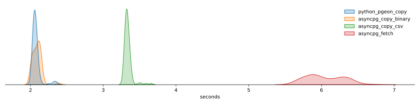

# Pgeon 🐦

The fastest flight from [PostgreSQL](https://www.postgresql.org/) to [Apache Arrow](https://arrow.apache.org/).

`pgeon` provides a C++ library and (very) simple python bindings. Almost all
PostgreSQL native types are supported (see [below](#notes))

This project is similar to [pg2arrow](https://github.com/heterodb/pg2arrow) and is heavily inspired by it. The main differences are the use of `COPY` instead of `FETCH` and that our implementation uses the Arrow C++ API.

## Performance

Duration distributions from 100 consecutive runs of a query fetching 7 columns (1 timestamp, 2 ints, 4 reals)
and returning around 4.5 million rows.



The received `pyarrow` table can be further converted into a `pandas` dataframe in less than 25ms!

## Try it out

Open the project in VS code Dev container.

After building the project, create a few sample tables with

```shell
cd /workspace/tests
sh create_tables.sh
```

To test it out
```shell
export LD_LIBRARY_PATH=/workspace/build
cd /workspace/python/build/lib.linux-x86_64-cpython-310

python <<EOF
import os
from pgeon import copy_query

connstr = os.environ["POSTGRES_CONN"]
req = "select * from numeric_table"

print(copy_query(connstr, req))
EOF
```

## TODO

* Tests & benchmarks

* Error handling: replace the hideous and error prone `unpack(buf); buf += ...` with a Buffer struct; that would allow to return `Status` instead of the read len

* Multi platform build / package / deploy

* Batchbuilder simple `void (*callback)(std::shared_ptr<arrow::RecordBatch>)` interface

* Standalone Flight server

* Is there any issue with `COPY` ? If so, explore use of `FETCH` again

* Output format for bit(..)

* User options

  - control which strings (or columns) should be dict encoded. maybe as a default char varchar should be dict encoded and text should be large_utf8

  - review of bytes vs string and encoding

* python bindings

  - propagate user_options

  - proper package / docstring / etc...

## Notes

  * SQL arrays are mapped to `pyarrow.list_(...)`. Only 1D arrays are fully supported. Higher dimensional arrays will be flattened.

  * PostgreSQL `Range` types are not supported.
