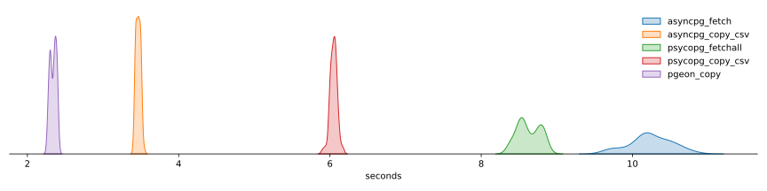

# Pgeon 🐦

[](https://github.com/0x0L/pgeon/actions/workflows/build.yml)
[](https://github.com/0x0L/pgeon/blob/main/LICENSE)

The fastest flight from [PostgreSQL](https://www.postgresql.org/) to [Apache Arrow](https://arrow.apache.org/).

`pgeon` provides a C++ library and (very) simple python bindings. Almost all
PostgreSQL native types are supported (see [below](#notes)).

This project is similar to [pg2arrow](https://github.com/heterodb/pg2arrow) and is heavily inspired by it. The main differences are the use of `COPY` instead of `FETCH` and that our implementation uses the Arrow C++ API.

## Performance

Duration distributions from 100 consecutive runs of a query fetching 7 columns (1 timestamp, 2 ints, 4 reals)
and returning around 4.5 million rows.



The received `pyarrow.Table` can be further converted into a `pandas.DataFrame` in less than 25ms!

## Try it out

### Developer Notes

In order to create a sensible environment you can do `conda env create -f environment.yml` or open the project in the dev container with VSCode.

### Building the C++ library and programs

- `conda activate pgeon-dev`
- `mkdir build && cd build`
- `cmake -GNinja ..`

### Building the Python wrapper

In order to install the Python wrapper you can use standard Python tooling for packages, e.g.

- `pip install .`

Open the project in VS code dev container and build it. In the terminal, create a few sample tables with

```shell
sh tests/create_tables.sh
```

To test it out

```python
import os
from pgeon import copy_query

db = os.environ["PGEON_TEST_DB"]
tbl = copy_query(db, "select * from numeric_table")

print(tbl)
```

## TODO

- Tests & benchmarks

- Error handling: replace the hideous and error prone `unpack(buf); buf += ...` with a Buffer struct; that would allow to return `Status` instead of the read len

- Multi platform build / package / deploy

- Batchbuilder simple `void (*callback)(std::shared_ptr<arrow::RecordBatch>)` interface

- Standalone Flight server

- Is there any issue with `COPY` ? If so, explore use of `FETCH` again

- Output format for bit(..)

- Properly integrate UserOptions

  - control which strings (or columns) should be dict encoded. maybe as a default char varchar should be dict encoded and text should be large_utf8

  - review of bytes vs string and encoding

- python bindings

  - propagate user_options

  - proper package / docstring / etc...

## Notes

- SQL arrays are mapped to `pyarrow.list_(...)`. Only 1D arrays are fully supported. Higher dimensional arrays will be flattened.

- BitString types output format is not really helpful

- tsvector types with letter weights are not supported

- PostgreSQL range and domain types are not supported.
